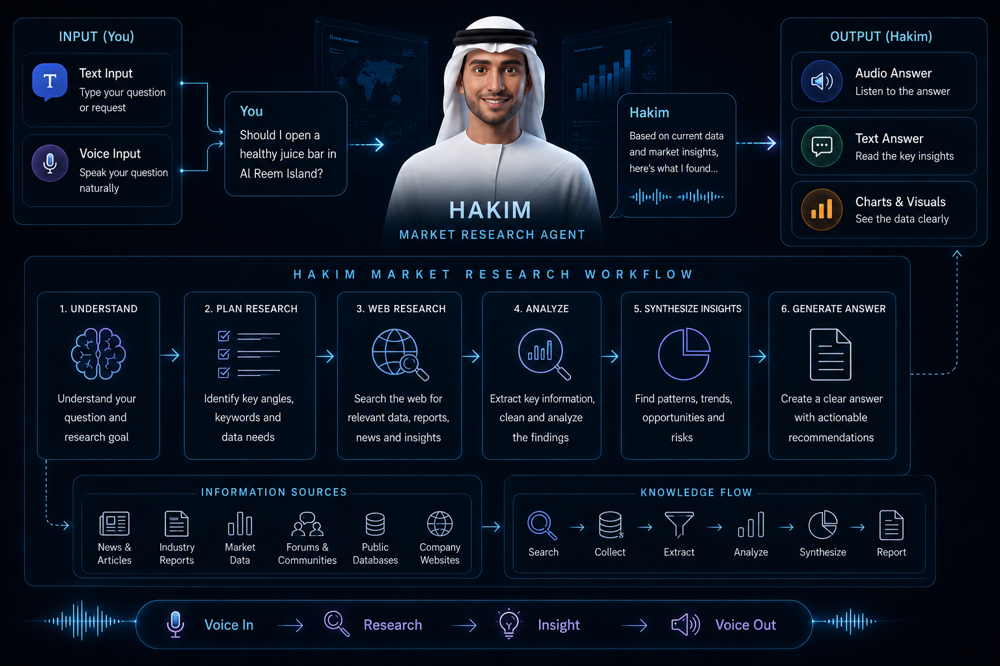

# Hakim AI

**A bilingual AI market-research assistant for rural UAE entrepreneurs.**



Hakim AI helps local entrepreneurs make better business decisions using evidence
instead of guesswork. Entrepreneurs can **speak or type naturally in English or
Arabic**, describe a business idea, and receive a structured market-research
response covering:

- Feasibility
- Target audience
- Go-to-market strategy
- Key risks
- UAE-specific evidence and citations
- A simple chart to support decision-making

Built for the **Tatweer Hackathon**, Challenge 3: _The data gap for local
entrepreneurs_. Hakim AI is built for rural UAE communities where many people
have strong business ideas but limited access to local market data, customer
insights, or professional research support.

---

## The problem

Local entrepreneurs in rural communities often make decisions without enough
evidence. They may not know:

- Who their real customers are
- Whether there is enough demand
- What competitors already exist
- Whether the idea is feasible in a rural setting
- What data they should collect before investing money

This leads to guessing, over-investing too early, or missing opportunities that
are actually valuable to the community. Hakim AI addresses this by turning a
simple business idea into a practical, UAE-grounded market-research briefing.

## Target demographic

Hakim AI is designed for local entrepreneurs in rural UAE communities: small
business owners, home-based sellers, farm-related and tourism-adjacent
businesses, and young entrepreneurs testing their first idea, in Arabic or
English, with a preference for voice interaction. These users may not have a
data team, a business consultant, or a market-research background. Hakim gives
them a simple way to ask:

> "Is this business idea worth trying, and what should I do next?"

## Solution overview

Hakim AI is an AI chatbot avatar that users can talk to or chat with. The user
enters a business idea in English or Arabic, for example:

> "I want to sell camping supply boxes for people visiting for stargazing."

Hakim then uses a custom UAE-focused market-research tool to generate a
structured response:

- **A clear text summary** — a practical briefing with a feasibility verdict,
  target audience, recommended strategy, and risks.
- **A chart** — a simple visual built from the most decision-relevant available
  data or clearly marked estimates.
- **Citations** — UAE-specific sources used to support the answer.
- **Voice output** — the avatar speaks the answer back while the text is also
  shown on screen.

This makes the tool accessible to users who prefer conversation over reading
long reports.

## How it works

Hakim AI has three layers:

1. **Conversational interface** — voice input, text chat, English/Arabic
   prompts, avatar speech output, and on-screen text. It feels closer to asking
   a helpful advisor than using a technical dashboard.
2. **UAE market-research tool** — the idea is sent to an LLM with a custom
   `market_researcher` tool that focuses only on the UAE, prefers
   emirate-level evidence, searches the web for real sources, avoids fabricated
   statistics, separates verified data from estimates, and returns structured
   JSON:

   ```json
   { "text_summary": "...", "chart_data": [ ... ], "data_citation": [ ... ] }
   ```

3. **Decision-ready output** — not generic advice, but a practical next step:
   who to target first, what to test before launching, what demand signals to
   look for, what risks to consider, and what evidence supports the
   recommendation.

### Live architecture (`/hakim`)

`/hakim` is a full-screen talking avatar. The user talks (Arabic or English) and
the avatar listens live, answers out loud, and a side panel renders the grounded
UAE market data (a chart) and the sources behind it. Typing is also supported.

Voice is hands-free: browser-side **voice-activity detection** (Silero VAD via
`@ricky0123/vad-web`) detects when the user starts and stops talking, each
utterance is transcribed by **OpenAI `gpt-4o-transcribe`** (auto-detects Arabic
vs English), and the user can barge in to interrupt the avatar mid-sentence. A
fast planning pass answers small talk instantly and only runs the research flow
when a question actually needs it.

```
Browser (/hakim)  ──session token──▶  Next /api/anam/session-token ──▶ Anam API
      │  WebRTC video + voice  ◀────────────────────────────────────────┘
      │  VAD detects an utterance ──▶ Next /api/transcribe ──▶ FastAPI /transcribe
      │                                          └─ OpenAI gpt-4o-transcribe
      │  message ──▶ Next /api/plan  ──▶ FastAPI /plan   (small talk vs research?)
      │  message ──▶ Next /api/agent ──▶ FastAPI /agent  (research)
      │                                          └─ OpenAI + market_researcher tool
      └─ speaks spoken_text via Anam, renders research (chart + citations)
```

The Anam persona is created with `llmId: "CUSTOMER_CLIENT_V1"` (brain disabled),
so we own the conversation logic and render the structured tool output in the
browser. Anam supplies the face and voice only; its built-in mic input is muted
so all transcription goes through OpenAI. Headphones are recommended so the
avatar's own voice doesn't trigger the mic.

## Benchmark: falsifiability and evidence

To avoid vague AI hype, we created a custom benchmark to test whether Hakim gives
useful, grounded answers for rural UAE entrepreneurs.

- **50 handcrafted question-answer samples**, written by **four contributors**.
- Realistic UAE entrepreneurship scenarios, including **10 Arabic questions** in
  local UAE style.
- Four categories: local demand discovery, business idea validation, competition
  and online research, and rural feasibility and constraints.

Each sample contains a realistic entrepreneur question, a strong reference
answer, and a clear expected reasoning pattern (e.g. whether the assistant
recommends evidence collection, small-scale validation, competitor checking, or
feasibility testing before investment). This lets us evaluate Hakim in a
falsifiable way: instead of claiming it is helpful, we compare its responses
against human-written references and check whether it gives specific,
UAE-relevant, practical, and evidence-aware guidance.

### Result

Evaluated with an **LLM-as-judge** setup, Hakim AI achieved **74% accuracy** on
the 50-sample benchmark.

### Example (English)

> **Q:** I want to open a small karak and snacks kiosk near my rural town. How
> can I check if people actually want it?
>
> **Reference answer:** Start with a one-week demand test before renting
> anything. Ask 30 nearby residents, farm workers, and weekend visitors three
> questions: when they pass the area, what they currently buy, and how much they
> would pay for karak/snacks. Also run a simple WhatsApp pre-order form for
> Thursday–Saturday evenings. Launch only if you get at least 20 serious
> responses or 10 paid pre-orders.

### Example (Arabic)

> **س:** أبغي أفتح مشروع توصيل طلبات بسيط في منطقتي. كيف أعرف إذا الناس فعلاً
> محتاجينه؟
>
> **الإجابة المرجعية:** أبدأ بتجربة بسيطة لمدة أسبوع. سوِّ فورم على واتساب أو
> Google Forms واسأل الناس: شو أكثر شيء يطلبونه من برّا المنطقة؟ كم مرة بالأسبوع؟
> وكم مستعدين يدفعون للتوصيل؟ إذا جمعت 15 طلبًا مدفوعًا أو 5 عملاء كرروا الطلب،
> فغالبًا الفكرة تستحق تكمل فيها.

## Integrity: citation-gated researcher agent

When someone asks a business question, Hakim does not treat the response as valid
unless the researcher tool provides citations alongside the answer. If the tool
cannot support its output with evidence, that answer is not used. Supported
findings stay separate from assumptions, so when someone asks "how do you
know?", the answer is cited evidence, not AI confidence.

## This repository

| Part | What it is |
| --- | --- |
| `app/`, `components/`, `lib/` | The Next.js site + the live `/hakim` agent UI |
| `lib/data.ts` | Editable content: benchmark stats, sample QA, accuracy, criteria copy |
| `market_research/` | The Python FastAPI agent service + `market_researcher` tool |
| `public/hakim.png` | The Hakim AI avatar image |

## Tech stack

- **Next.js (App Router)** + **TypeScript**, **Tailwind CSS v4**
- **Framer Motion** (animations), **Recharts** (charts), **lucide-react** (icons)
- **Anam AI** real-time avatar (client-side custom LLM)
- **OpenAI** (`gpt-4.1` orchestration + research, `gpt-4o-transcribe` speech-to-text)
- **Silero VAD** (`@ricky0123/vad-web`) for hands-free voice
- **FastAPI** Python service wrapping the `market_researcher` tool
- Fonts: Space Grotesk (display), Inter (body), IBM Plex Sans Arabic (RTL)

## Environment

Create a `.env` in the project root (git-ignored):

```bash
OPENAI_API_KEY=sk-...          # used by the Python agent service
ANAM_API_KEY=...               # used by Next.js to create the avatar/persona and mint session tokens
AGENT_SERVICE_URL=http://127.0.0.1:8001
# ANAM_VOICE_ID=...            # optional: force a specific Anam voice
```

## Getting started

```bash
# 1. Web app deps (postinstall copies the VAD model + ONNX wasm into public/vad)
npm install

# 2. Python agent service deps (isolated venv)
python3 -m venv .venv
.venv/bin/pip install -r requirements.txt

# 3. Create the Hakim avatar + persona once (writes anam-agent.json)
npm run setup:anam

# 4. Run both processes (in two terminals)
npm run agent     # Python FastAPI agent on :8001
npm run dev       # Next.js app on :3000
```

Open [http://localhost:3000](http://localhost:3000) and click **Try Agent**.

Helpful scripts:

- `npm run setup:voice` — re-provision the persona with a freshly-picked male
  voice (set `ANAM_VOICE_ID` to choose a specific one).
- `npm run setup:vad` — re-copy the VAD/ONNX runtime assets into `public/vad`.

> Note: creating a custom avatar from `hakim.png` requires an Anam enterprise
> plan. Without it, `setup:anam` falls back to a stock avatar (the persona,
> voice, and full agent still work). Swap `avatarId` in `anam-agent.json` to use
> a different face.

## Build & deploy

```bash
npm run build
npm start
```

The site is a lightweight Next.js app and deploys to **Vercel**: low cost,
scales to zero when idle, minimal maintenance.

## Editing content

All landing-page copy and numbers (benchmark stats, sample QA, accuracy,
criteria text, repo URL, citation-gate note) live in
[`lib/data.ts`](lib/data.ts). Update values there, no component changes needed.

## Home page sections

1. **Hero** — Hakim AI intro + `Try Agent` call to action.
2. **Benchmark** — 50 curated QA, build hours, contributors, two example QA
   (English + Arabic), and the citation-gating integrity note.
3. **Score** — 74% accuracy (LLM-as-judge) and what was measured.
4. **Impact / Relevance / Feasibility / Readiness / Scalability** — judging
   criteria evidence.
5. **Repository & documentation** — repo link and what this README covers.

## Why Hakim AI matters

Many entrepreneurs don't need a complex business report. They need clear answers
to simple but important questions: Is this idea worth testing? Who should I sell
to first? What data should I collect? What could make this fail? What's the
cheapest way to validate it? Hakim gives that guidance in a simple,
conversational way, moving rural entrepreneurship from guessing to
evidence-based action.
